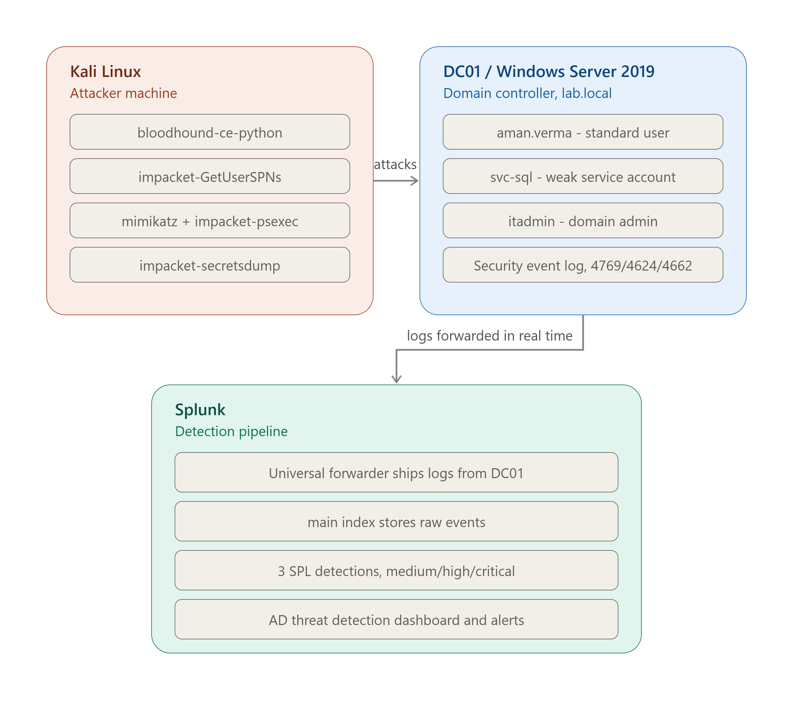
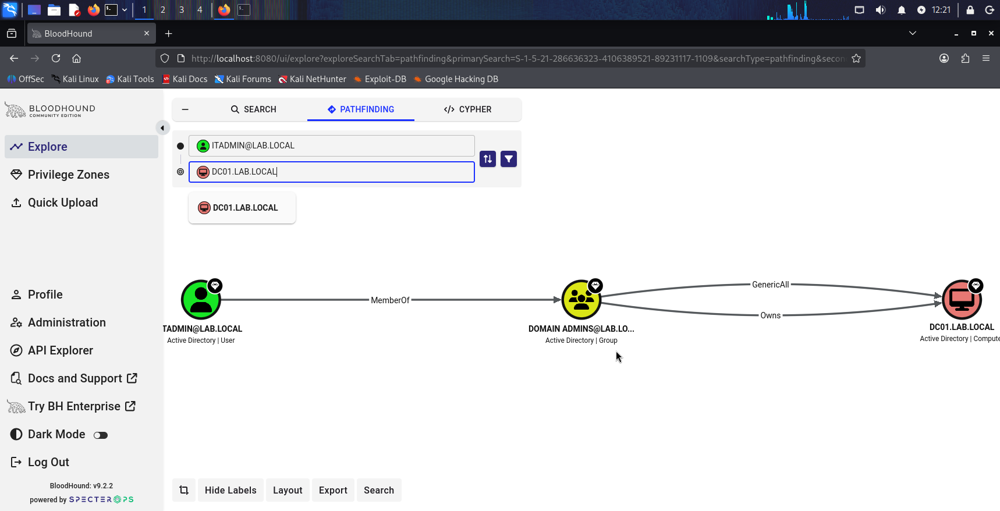
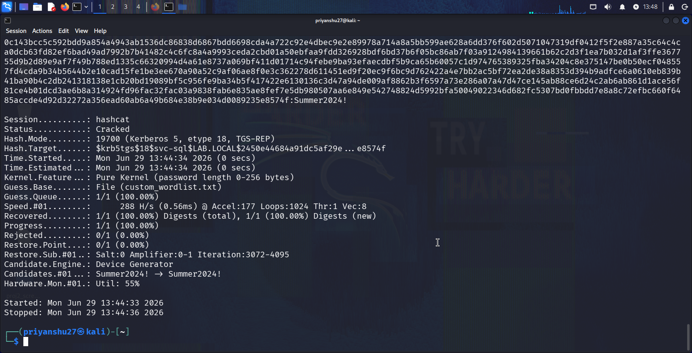
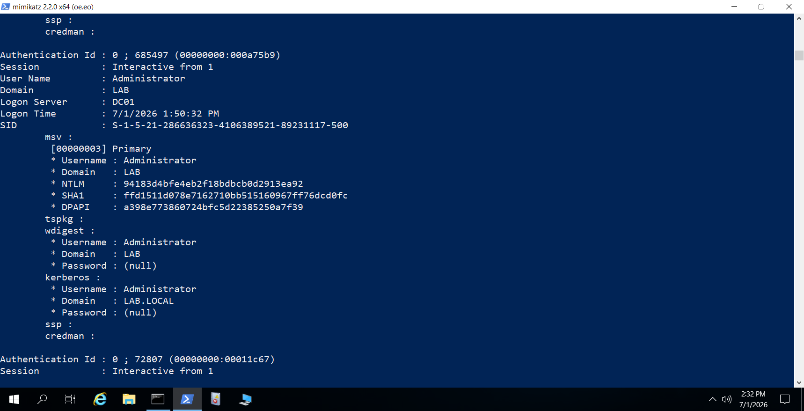
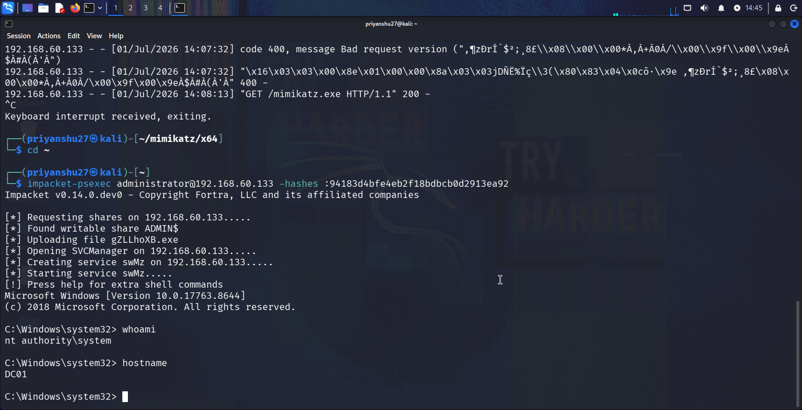
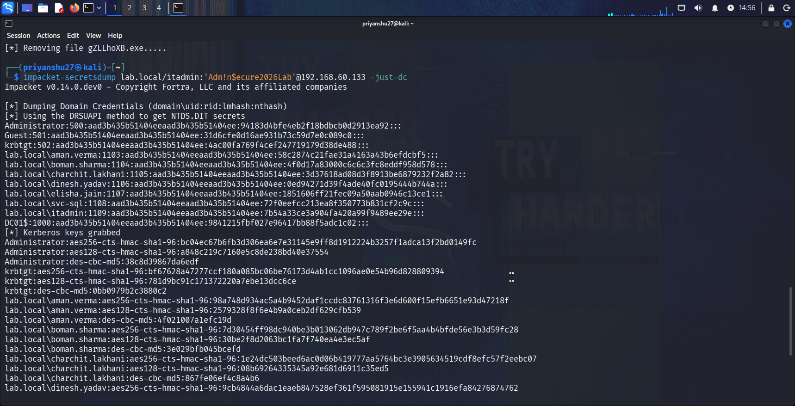
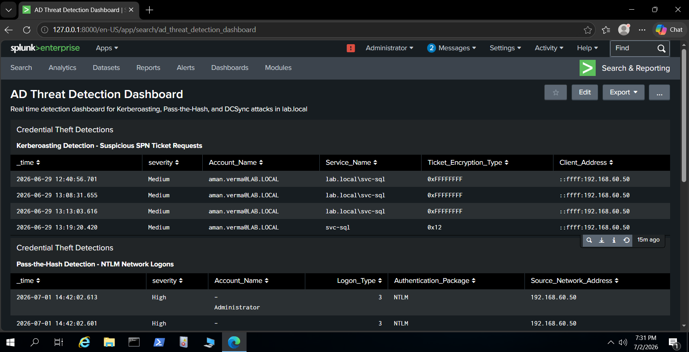
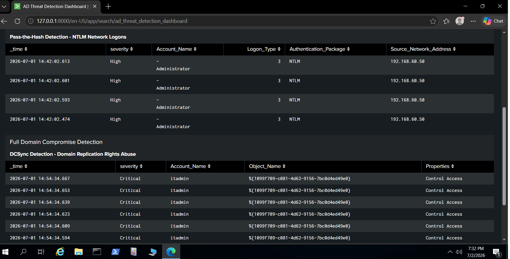

# Active Directory Attack Simulation & Detection Lab

**Author:** Priyanshu Singh Rajpurohit
**Lab period:** June 28 – July 2, 2026

---

## What this project is

I built a small Active Directory environment from scratch, attacked it myself using the same techniques real attackers use, and then went back and detected everything I did using Splunk. The whole point was to understand both sides — what an attacker actually does step by step, and what that looks like in the logs afterward.

This was my second SOC-focused project. The first one was a simple brute force detection using Hydra and Event Viewer. This one is a lot more involved — it covers a full attack chain that mirrors how a real breach usually escalates: recon, credential theft, lateral movement, and finally full domain compromise.

I didn't follow one single tutorial for this. I ran into a lot of real problems along the way — wrong tool versions, Windows security updates blocking my attacks, Splunk quirks that took hours to figure out. Claude helped me a lot througout the whole project — and I kept all of that in this report instead of hiding it, because figuring that stuff out was honestly most of the actual learning.

---

## Lab setup

- **Windows Server 2019** promoted to a Domain Controller (`lab.local`, hostname `DC01`)
- **Kali Linux** as the attacker machine
- **Splunk Enterprise** (trial) with a Universal Forwarder installed on the DC, sending Windows Security Event Logs in real time

I created three types of accounts on purpose to represent a realistic small company:

| Account | Role | Why it exists |
|---|---|---|
| `aman.verma` (+ 4 more) | Normal employee | Represents a low-privilege account an attacker might phish first |
| `svc-sql` | Service account, SPN attached, weak password (`Summer2024!`) | Deliberately vulnerable target for Kerberoasting |
| `itadmin` | Domain Admin | Represents the high-value account an attacker is ultimately after |


### Architecture



---

## The attacks

I ran four things, in an order that actually tells a story — each one built on the last, the same way a real attacker would escalate:

### 1. Recon — BloodHound

Using nothing but `aman.verma`'s normal login, I ran BloodHound's collector against the domain. It maps out every user, group, and permission relationship — and any regular domain user is allowed to pull this data, no special access needed.

The result showed a clean path: `itadmin` is a member of `Domain Admins`, which has full `GenericAll`/`Owns` rights over `DC01`. In other words, thirty seconds in, I already knew exactly which account to go after.



### 2. Kerberoasting

I requested a Kerberos service ticket for `svc-sql` using Impacket's `GetUserSPNs`. The ticket comes back encrypted with the target account's password hash — you can take that offline and crack it without touching the network again.

This is where I hit my first real wall. Microsoft rolled out a 2026 hardening update that disables RC4 encryption by default (the encryption type Kerberoasting traditionally relies on), so my first several attempts failed outright with a `KDC_ERR_ETYPE_NOSUPP` error. I had to explicitly re-enable RC4 on the target account (`msDS-SupportedEncryptionTypes`) before the attack would even work. Once it did, the ticket came back as AES256 instead of the classic RC4, which meant I also had to use a different Hashcat mode (19700, not the usual 13100) than what most guides mention.

I also learned that `rockyou.txt` — the wordlist basically every guide defaults to — was compiled in 2009, so it physically cannot contain a password like `Summer2024!`. I built a small custom wordlist instead once I realized that, which is actually closer to how real analysts work anyway — targeted lists based on what you already know about the environment, not blind brute force.

Password cracked: `Summer2024!`



### 3. Pass-the-Hash

Using Mimikatz on the DC (with Windows Defender temporarily disabled, since it deletes Mimikatz on sight), I dumped the Administrator account's NTLM hash straight out of memory:

```
94183d4bfe4eb2f18bdbcb0d2913ea92
```

Then, from Kali, I used `impacket-psexec` with just that hash — no password — and got a shell:

C:\Windows\system32> whoami
nt authority\system






---

I never touched the real Administrator password. Windows accepted the hash directly, because that's exactly what NTLM authentication allows — the hash itself is enough. This is the whole reason Pass-the-Hash works and why it's such a common technique in real breaches.

### 4. DCSync

Using `itadmin`'s Domain Admin rights, I ran `impacket-secretsdump` with the `-just-dc` flag. This makes Kali pretend to be a second Domain Controller asking for a routine replication sync — and DC01 answered, because Domain Admins genuinely have that permission (`Replicating Directory Changes`).

The result was every password hash in the domain, in one command — including `krbtgt`, which is the account used to sign every Kerberos ticket issued in the domain. Anyone holding that hash can forge tickets that the whole domain will trust, even after a full password reset — this is what's called a Golden Ticket attack, and it's the reason DCSync is considered one of the most severe things that can happen to an AD environment.



---

## MITRE ATT&CK mapping

| Attack | Tactic | Technique |
|---|---|---|
| BloodHound recon | Discovery | T1087.002 – Account Discovery: Domain Account |
| Kerberoasting | Credential Access | T1558.003 – Steal or Forge Kerberos Tickets: Kerberoasting |
| Mimikatz hash dump | Credential Access | T1003.001 – OS Credential Dumping: LSASS Memory |
| Using the stolen hash | Lateral Movement | T1550.002 – Use Alternate Authentication Material: Pass the Hash |
| DCSync | Credential Access | T1003.006 – OS Credential Dumping: DCSync |

I want to be upfront about something: I don't have all of these IDs memorized, and I don't think that's actually the expected standard. What matters is that I know how to look this up properly when I need to — which is what real analysts do too. ATT&CK has 600+ techniques; nobody has that memorized.

---

## Detection — turning the attacker's footprints into alerts

This was the actual point of the whole project. Every attack above left something behind in the Windows Security Event Log, and Splunk's Universal Forwarder had been quietly shipping all of it in real time the entire time I was attacking.

### Detection 1 — Kerberoasting

```spl
index=main EventCode=4769 host="DC01*" NOT Account_Name="*$" NOT Service_Name="*$" Service_Name!="krbtgt"
| eval severity="Medium"
| table _time severity Account_Name Service_Name Ticket_Encryption_Type Client_Address
| sort _time
```

The core idea: a *human* account requesting a service ticket for a *service* account is the actual signature of Kerberoasting — not the encryption type. I originally built this filtering on RC4 (`0x17`), which is what most guides teach, but since my ticket came back as AES256 because of the RC4 deprecation, that filter would have completely missed my own attack. Filtering on who's asking for what is a more reliable signature regardless of encryption type used.

This isolated exactly 4 real events out of 131 total 4769 events on the DC.

### Detection 2 — Pass-the-Hash

```spl
index=main EventCode=4624 host="DC01*" Logon_Type=3 Authentication_Package=NTLM Account_Name="Administrator"
| eval severity="High"
| table _time severity Account_Name Logon_Type Authentication_Package Source_Network_Address
```

The signature here is NTLM authentication showing up for a network logon at all. In a healthy, modern domain almost everything authenticates over Kerberos — NTLM appearing, especially for a high-value account, is the tell. This also caught the attacker's source IP automatically.

### Detection 3 — DCSync

```spl
index=main EventCode=4662 host="DC01*" "1131f6ad-9c07-11d1-f79f-00c04fc2dcd2" NOT Account_Name="*$" earliest=-7d latest=now
| eval severity="Critical"
| table _time severity Account_Name Object_Name Properties
```

That long string is the specific GUID for the `DS-Replication-Get-Changes-All` permission — this only shows up when someone requests full directory replication. I excluded machine accounts (`DC01$`) here on purpose, because Domain Controllers legitimately replicate with each other constantly as part of normal operation, and without that exclusion this alert would fire on completely normal background traffic all day, which is exactly the kind of thing that causes real analysts to start ignoring their own alerts.

### A couple of things that went wrong along the way, worth mentioning

- Classic Splunk dashboards treat `$` as a special token character. My exclusion filters (`!="*$*"`) worked fine in the regular search page but silently broke inside dashboard panels, either hanging forever waiting for a token that didn't exist, or — worse — matching nothing at all and letting all the noise back in. I only caught this because a "fixed" panel suddenly jumped from 4 rows to 110. Switching to `NOT Account_Name="*$"` syntax avoided the issue entirely.
- I built each SPL query by first dumping every candidate field into a table (`| table field1 field2 ...`) and seeing which ones actually populated, instead of guessing field names. Splunk's field naming isn't always what you'd expect from the raw Windows event, and guessing wasted a lot more time than just checking.

---

## Alerts

All three detections were converted into scheduled Splunk alerts (checked every 5 minutes, throttled to avoid duplicate firing on the same incident), each with a severity assigned based on how far the attack had actually progressed by the time it fires — not just how dangerous the technique sounds in general:

- **Kerberoasting — Medium.** It's an attempt at that point; the attacker still has to crack the password offline.
- **Pass-the-Hash — High.** By the time this fires, the attacker already has SYSTEM-level access to the DC.
- **DCSync — Critical.** By the time this fires, the entire domain's credentials — including krbtgt — are already gone. There's no "in progress" version of this one.

---

## Dashboard

Built a single "AD Threat Detection Dashboard" with all three detections grouped under two headers — Credential Theft Detections (Kerberoasting + Pass-the-Hash) and Full Domain Compromise Detection (DCSync) — so it reads as a severity-ordered story rather than a flat list of unrelated panels.






---

## What I'd actually take away from this

Running the attacks myself before trying to detect them made a real difference in how I understood the logs afterward. I wasn't just pattern-matching field names I'd read about — I knew exactly what generated each event, because I'd generated it minutes earlier. That connection is something I don't think you get from only reading about these techniques.

---

## Tools used

Kali Linux, BloodHound CE, Impacket (GetUserSPNs, psexec, secretsdump), Mimikatz, Hashcat, Windows Server 2019 (Active Directory Domain Services), Splunk Enterprise (Universal Forwarder, SPL, Alerts, Dashboards)
